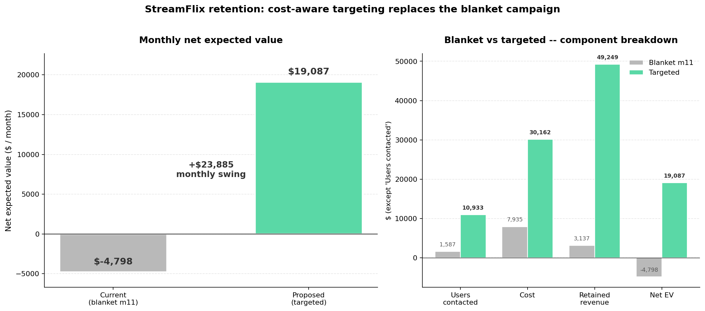

# 💸 StreamFlix Subscriber Retention — Cost-Aware Churn Targeting

[](https://janeruxi1-streamflix-churn-retention.streamlit.app/)


> **Cost-aware customer-retention system** for a streaming subscription business modeled on real subscription-economy dynamics (churn bands, tenure spikes, engagement cohorts, intervention menus). End-to-end: from a calibrated churn-probability model to an ROI-optimized intervention policy and a deployed decision-support tool. Sister project to [`StreamFlix-AB-Testing`](https://github.com/janeruxi1/StreamFlix-AB-Testing), built on the same StreamFlix context.



**Bottom line:** the current blanket $5 credit campaign runs a $6.3k monthly loss. The targeted policy delivers **+$3.3k net expected value at less than 6% of the current spend** — a **$9.6k monthly swing**. Full analysis in [`notebooks/06_decision_rule.ipynb`](./notebooks/06_decision_rule.ipynb); recommendation in [`reports/decision_memo.md`](./reports/decision_memo.md).

---

## 📌 Business Problem

StreamFlix runs a paid streaming subscription with ~2.1M monthly subscribers and a ~5.5% monthly churn rate. The Retention team currently runs a blanket $5-credit campaign every month at month-11 — expensive, untargeted, and without ROI measurement.

The PM wants to **replace the blanket campaign with a cost-aware targeting system** that, for each subscriber:

1. Predicts the probability they will churn in the next 30 days
2. Recommends the cheapest intervention expected to retain them
3. Decides whether to engage at all, given a fixed monthly budget

Full PM brief: [`reports/scenario_brief.md`](./reports/scenario_brief.md)
Metric framework: [`reports/metrics_framework.md`](./reports/metrics_framework.md)

---

## 🎯 What This Project Demonstrates

| Skill | Where it shows up |
|---|---|
| Business framing & metric design | `reports/scenario_brief.md`, `reports/metrics_framework.md` |
| Synthetic dataset design with embedded ground truth | `src/data/simulate.py` |
| Data audit & distribution checks | `notebooks/01_data_audit.py` |
| Exploratory + survival analysis (KM, landmark analysis) | `notebooks/02_eda.py` |
| Feature engineering with reusable transformers | `notebooks/03_feature_engineering.py`, `src/features/` |
| Model training, calibration, and evaluation | `notebooks/04_modeling.py`, `src/models/` |
| Model bake-off across 4 families + Optuna tuning | `notebooks/04b_model_comparison.py` |
| Experiment tracking (MLflow) | `src/models/tracking.py`, `notebooks/04_modeling.py`, `04b_model_comparison.py`, `08_uplift_modeling.py` |
| SHAP explainability framed as actionable retention levers | `notebooks/05_shap_levers.py` |
| Cost-aware decision rule + ROI sweep *(v1 policy)* | `notebooks/06_decision_rule.py`, `src/decisions/` |
| Stakeholder decision memo + hero figure *(v1 recommendation)* | `reports/decision_memo.md`, `notebooks/07_hero_figure.py` |
| Interactive Streamlit decision-support app | `app/streamlit_app.py` |
| Causal / uplift modeling — T/S/X-learners + Qini + decile lift *(v2)* | `notebooks/08_uplift_modeling.py`, `src/models/uplift.py` |
| v1 vs v2 head-to-head against simulator ground truth | `notebooks/09_policy_comparison.py` |
| Fairness / segment-parity audit (calibration + recall) | `notebooks/10_fairness_audit.py` |
| Production code quality (tests, CI) | `src/`, `tests/`, `.github/workflows/` |

---

## 📊 Dataset (Synthetic)

Custom-designed for this project. ~50,000 monthly subscribers with realistic features: tenure, plan tier, billing cycle, engagement (watch hours, distinct titles, days since last login), billing health (past payment failures, auto-renew status), and support history. Churn outcome over a 30-day window with embedded ground-truth drivers.

**Why synthetic?** Building the dataset lets us embed known intervention uplifts and known customer LTV — exactly what the decision rule needs to optimize over. With a public dataset we'd have to invent these values anyway; here they're principled and consistent.

See [`data/README.md`](./data/README.md) for schema and ground-truth details.

```bash
python src/data/simulate.py    # regenerates BOTH files:
                               #   data/subscribers.csv              (v3 baseline, 28 cols — Phase 4-7)
                               #   data/subscribers_experiment.csv   (v4 + treatment, 33 cols — Phase 8)
```

The two files share the same 50,000 rows; the experiment file adds five columns from a simulated randomized A/B holdout. The split mirrors the project timeline — Phase 4-6 answer *"can we beat the blanket campaign?"* using pre-experiment data; Phase 8 answers *"now that we've run an A/B holdout, can per-user uplift do even better?"* using post-experiment data.

---

## 🗂️ Project Structure

```
02-customer-churn/
├── README.md                        # You are here
├── LICENSE                          # MIT
├── data/
│   ├── README.md                    # Schema & ground truth for BOTH files below
│   ├── subscribers.csv              # v3 baseline (28 cols) — Phase 4-7
│   └── subscribers_experiment.csv   # v4 + treatment layer (33 cols) — Phase 8
├── notebooks/                       # Analyses and figure generators
│   ├── 01_data_audit.py / .ipynb        # Schema + distributions + signal screen
│   ├── 02_eda.py / .ipynb               # Segment rates + KM + landmark analysis
│   ├── 03_feature_engineering.py / .ipynb  # Reusable feature transforms
│   ├── 04_modeling.py / .ipynb          # LR baseline → XGBoost + calibration (v1 model)
│   ├── 04b_model_comparison.py / .ipynb # 4-family bake-off + Optuna tuning (audit)
│   ├── 05_shap_levers.py / .ipynb       # SHAP → actionable retention levers
│   ├── 06_decision_rule.py / .ipynb     # Cost-aware policy + ROI sweep (v1 policy)
│   ├── 07_hero_figure.py / .ipynb       # Builds reports/figures/07_hero_summary.png
│   ├── 08_uplift_modeling.py / .ipynb   # v2: causal uplift (T/S/X-learner) + Qini
│   ├── 09_policy_comparison.py / .ipynb # v1 vs v2 head-to-head vs ground truth
│   └── 10_fairness_audit.py / .ipynb    # Segment performance + calibration parity
├── src/                             # Reusable, tested modules
│   ├── data/
│   │   ├── simulate.py              # Synthetic data generator
│   │   └── loader.py
│   ├── features/
│   │   └── transforms.py            # RFM, behavioral, billing aggregates
│   ├── models/
│   │   ├── train.py                 # Train + persist
│   │   ├── evaluate.py              # ROC/PR/Brier/calibration + Qini AUC
│   │   ├── explain.py               # SHAP utilities
│   │   ├── uplift.py                # T/S/X-learners for causal uplift
│   │   ├── tracking.py              # MLflow context + Registry promotion
│   │   └── production.py            # Single source of truth for shipped models
│   └── decisions/
│       └── policy.py                # Cost-aware decision rule
├── tests/                           # pytest unit tests
├── app/
│   └── streamlit_app.py             # Decision-support UI
├── reports/
│   ├── scenario_brief.md            # PM brief
│   ├── metrics_framework.md         # Metric tier definitions
│   ├── decision_memo.md             # Stakeholder recommendation
│   └── figures/                     # Output PNGs
├── pytest.ini
├── requirements.txt
└── .github/workflows/ci.yml
```

---

## 🚀 Quick Start

```bash
pip install -r requirements.txt
python src/data/simulate.py                  # generate both CSVs (baseline + experiment)
python notebooks/04_modeling.py              # train + persist the churn model (uses baseline)
python notebooks/08_uplift_modeling.py      # train + persist the uplift model (uses experiment)
pytest tests/                                # run the 79 unit tests
streamlit run app/streamlit_app.py           # launch the decision-support app
```

---

## 🎮 Interactive demo (Streamlit)

The retention team can interact with the policy without touching the notebooks:

```bash
streamlit run app/streamlit_app.py
```

Two tabs:
- **Policy overview** — KPI row (users targeted, cost, net EV, ROI), head-to-head against the current blanket-m11 baseline, lever mix
- **Per-user lookup** — pick a subscriber ID, see the risk score, diagnostic features, and recommended lever

Sidebar controls let anyone poke at the budget, per-lever cost, uplift assumptions, and blanket-baseline parameters. The app imports directly from `src/`, so the math is the same as the notebooks and is protected by the same 79 unit tests. See [`app/README.md`](./app/README.md) for deployment to Streamlit Community Cloud.

**Live demo:** [https://janeruxi1-streamflix-churn-retention.streamlit.app/](https://janeruxi1-streamflix-churn-retention.streamlit.app/)

---

## 📈 Experiment tracking (MLflow)

Every model run — across `notebooks/04_modeling.py` (production pipeline), `notebooks/04b_model_comparison.py` (bake-off + tuning), and `notebooks/08_uplift_modeling.py` (causal uplift bake-off) — is wrapped in an MLflow context (`src/models/tracking.py`) that logs parameters, metrics, and the fitted model. Ten runs land in the local SQLite store (`mlflow.db`): `lr_baseline`, `xgboost_uncalibrated`, `xgboost_calibrated`, `hist_gbm`, `random_forest`, `xgboost_tuned`, plus the four Phase 8 uplift runs `uplift_s_learner`, `uplift_t_learner`, `uplift_x_learner`, `uplift_class_transform`. Launch the tracking UI with `mlflow ui` from the project root; runs appear under the `streamflix_churn` experiment.

```bash
python notebooks/04_modeling.py        # runs land in mlruns/
mlflow ui                              # localhost:5000 — compare runs
```

**Model Registry — production promotion.** Logging models per run isn't the same as *deploying* them. Once a notebook picks a winner, `register_production_model()` (in `src/models/tracking.py`) promotes it to the MLflow Model Registry under a stable logical name and tags it with the `@production` alias:

| Registered name | Promoted by | Purpose |
|---|---|---|
| `streamflix_churn_production` | Phase 4 (calibrated XGBoost) | Per-user P(churn) for the decision rule |
| `streamflix_uplift_credit_5` | Phase 8 (winning uplift learner) | Per-user retention lift for the uplift-aware policy |

Every re-run creates a new numbered version; the `@production` alias moves to point at the latest one. Downstream jobs load the current winner without hardcoding a run ID:

```python
model = mlflow.pyfunc.load_model("models:/streamflix_churn_production@production")
```

Uses the modern alias-based API (MLflow 2.9+) with graceful fallback to the legacy `Production` stage on older versions. Roll-back = re-point the alias at the previous version.

The Streamlit app still loads from the pickle in `models/churn_model_v1.pkl` (portable, self-contained, works on Streamlit Cloud without a shared tracking server). The Registry is the audit trail / deployment-time lookup for anything running inside our infra.

**Single source of truth for what ships.** `src/models/production.py` declares — in one place — the pickle path, Registry name, artifact key, and MLflow load URI for each shipped model (`CHURN_MODEL_PATH`, `CHURN_MODEL_REGISTRY_NAME`, `load_production_churn_model()`, and the corresponding `UPLIFT_MODEL_*` constants for Phase 8). The Streamlit app, Phase 4/6/7/8 notebooks, and tests all import from this module — no hardcoded pickle paths anywhere else in the codebase. This means Phase 4's `pickle.dump()`, the Streamlit app's `load_production_churn_model()`, and `register_production_model(...)` are all *guaranteed* to point at the same artifact. A consistency test suite (`tests/test_production.py`) enforces the naming conventions and error messages.

MLflow is an optional dependency; if it isn't installed, both the tracking calls AND the Registry promotion no-op silently so the pipeline still works in lightweight environments (including CI). This keeps the code path clean without forcing every reviewer to install MLflow.

---

## 🧪 Testing & CI

The `src/` modules are covered by **72 pytest unit tests** that run on every push via GitHub Actions across Python 3.10, 3.11, and 3.12. Coverage spans:

- Cost-aware decision rule (EV math, best-lever selection, budget cap, premium cap, blanket-baseline simulator, policy summary)
- Feature engineering (idempotency, no-mutation, engineered-column ranges, tenure bucketing)
- Synthetic data generator (schema, reproducibility, churn rate in band, multi-window nesting for watch hours / tickets / payment failures)
- Metrics (PR-AUC, ROC-AUC, Brier, top-K precision/recall, calibration curve)
- Model prep (drops IDs and target, one-hot categoricals, bool → int, all numeric, no nulls)
- SHAP intervention map (lever/cost lookup, unknown-feature placeholder, one-hot suffix handling)
- Uplift models (per-user prediction shape, heterogeneity capture, Qini metric sanity, uplift-based policy skips sleeping dogs)

Two of the regression tests specifically catch bugs found during development: the simulator's multi-window watch-hour scaling, and the engineered trend-ratio clip ceiling.

Run locally: `pytest tests/`

---

## 📚 Roadmap

The project is built in 13 phases that mirror an end-to-end retention modeling workflow:

1. ✅ **Phase 0:** Project setup, PM brief, metric framework
2. ✅ **Phase 1:** Synthetic dataset generator + data audit
3. ✅ **Phase 2:** EDA + survival analysis (KM, landmark analysis, sensitivity)
4. ✅ **Phase 3:** Feature engineering
5. ✅ **Phase 4:** Modeling — LR baseline → XGBoost + calibration
6. ✅ **Phase 4b:** Model comparison — 4-family bake-off + Optuna tuning + MLflow tracking
7. ✅ **Phase 5:** SHAP — actionable retention levers
8. ✅ **Phase 6:** Cost-aware decision rule + ROI sweep *(v1 policy — propensity-based)*
9. ✅ **Phase 7:** Decision memo + Streamlit decision-support app *(v1 recommendation)*
10. ✅ **Phase 8:** Uplift (causal) modeling — T/S/X-learners + Qini AUC *(v2: per-user retention lift replaces the fixed-uplift constant)*
11. ✅ **Phase 9:** Head-to-head — v1 (propensity) vs v2 (uplift) scored against the simulator's ground-truth `true_uplift`
12. ✅ **Phase 10:** Fairness / segment-parity audit — PR-AUC + Brier + calibration + recall parity across plan tier, tenure bucket, engagement cohort, country
13. ✅ **Phase 11:** Production polish (79 unit tests, GitHub Actions CI, MIT license)

---

## 💼 Key methodological choices

- **Synthetic dataset with known intervention uplift & LTV** — lets the decision rule optimize over principled costs and benefits
- **Calibration treated as a first-class metric** — a discriminating but miscalibrated model mis-sizes the intervention budget
- **PR-AUC over ROC-AUC** as primary discrimination metric — appropriate for the imbalanced churn problem
- **Decision rule separated from model** — the model produces P(churn); the policy picks the optimal intervention per subscriber. Keeps modeling and business logic independent.
- **Cost-aware threshold optimization** — replaces the default 0.5 threshold with one chosen to maximize expected net retention value under a budget cap
- **Sensitivity analysis on budget and intervention cost** — the recommendation is robust to assumption changes
- **SHAP framed as retention levers, not feature importance** — every flagged subscriber is paired with a *what to do about it* line, by segment
- **Causal uplift modeling on top of the propensity model** — replaces the fixed-uplift constant in the decision rule with a learned per-user causal treatment effect, so the policy targets true persuadables and avoids sleeping dogs (users whom treatment would push toward churn)

---

## 📫 Author

Xi Ru · [LinkedIn](https://www.linkedin.com/in/xiru) · [Email](mailto:ruthruxi@gmail.com)