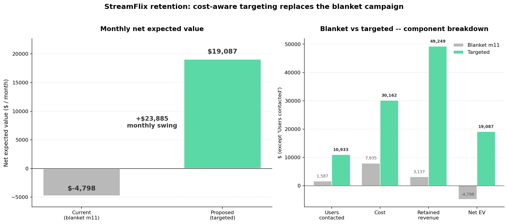

# 💸 StreamFlix Subscriber Retention — Cost-Aware Churn Targeting

[](https://janeruxi1-streamflix-churn-retention.streamlit.app/)


> **Cost-aware customer-retention system** for a streaming subscription business modeled on real subscription-economy dynamics (churn bands, tenure spikes, engagement cohorts, intervention menus). End-to-end: from a calibrated churn-probability model to an ROI-optimized intervention policy and a deployed decision-support tool. Sister project to [`StreamFlix-AB-Testing`](https://github.com/janeruxi1/StreamFlix-AB-Testing) and [`StreamFlix-RAG-evaluation`](https://github.com/janeruxi1/StreamFlix-RAG-evaluation), built on the same StreamFlix context.



**Bottom line:** the current blanket $5 credit campaign runs a $4.8k monthly loss. The targeted policy delivers **+$19.1k net expected value** at 1.64× ROI — a **$23.9k monthly swing** (on synthetic data with assumed lever uplifts; see [Limitations](#️-limitations--threats-to-validity)). Full analysis in [`notebooks/06_decision_rule.ipynb`](./notebooks/06_decision_rule.ipynb); recommendation in [`reports/decision_memo.md`](./reports/decision_memo.md).

**Fastest way in:** [`reports/PROJECT_SUMMARY.md`](./reports/PROJECT_SUMMARY.md) — single-page catalog of what was built + what was found across the three-part structure (churn model → decision rule → uplift enhancement), with every headline number traced to its source notebook.

---

## 📌 Business Problem

StreamFlix runs a paid streaming subscription with ~2.1M monthly subscribers and a ~5.5% monthly churn rate. The Retention team currently runs a blanket $5-credit campaign every month at month-11 — expensive, untargeted, and without ROI measurement.

The PM wants to **replace the blanket campaign with a cost-aware targeting system** that, for each subscriber:

1. Predicts the probability they will churn in the next 30 days
2. Recommends the cheapest intervention expected to retain them
3. Decides whether to engage at all, given a fixed monthly budget

Full PM brief: [`reports/scenario_brief.md`](./reports/scenario_brief.md)
Metric framework: [`reports/metrics_framework.md`](./reports/metrics_framework.md)

---

## ⚠️ Limitations & threats to validity

Read these before the headline numbers:

- **Synthetic data, partly circular evaluation.** The v2 "~21.9× retained revenue vs blanket" figure is scored against the simulator's own `true_uplift` column. It shows the pipeline can recover a planted signal, not that it would lift real revenue.
- **Assumed uplifts and LTV.** Only `credit_5` has (simulated) experimental data. The 5% (playlist) and 25% (upgrade) uplifts, and the LTV values, are assumptions, so the v1 ROI of 1.64× depends on them.
- **Random, not temporal, validation.** The split is a stratified random 60/20/20. There is no out-of-time test, and no explicit feature-cutoff timestamp is documented.
- **Uncertainty is wide.** On a 10k-row test set with 534 churners, the shipped model's PR-AUC is 0.18 against a 0.053 base rate, and a bootstrap 95% interval for the default configuration spans 0.14–0.20 ([`reports/metric_confidence_intervals.md`](./reports/metric_confidence_intervals.md)). The gain from tuning (+0.007) and the gaps between model families sit well inside that interval. The tuned-versus-default choice was also made on the test set, so the reported test metrics are slightly optimistic.
- **ROI target missed.** v1 reaches 1.64× against a 2.0× kickoff target; the memo lays out the budget trade-off.
- **Next step:** validate on a real dataset and run a production holdout A/B before trusting the uplift numbers.

---

## 🧭 Where things are

| Want to see… | Go to |
|---|---|
| One-page catalog of the whole project | [`reports/PROJECT_SUMMARY.md`](./reports/PROJECT_SUMMARY.md) |
| Recommendation to stakeholders | [`reports/decision_memo.md`](./reports/decision_memo.md) |
| Metric confidence intervals | [`reports/metric_confidence_intervals.md`](./reports/metric_confidence_intervals.md) |
| Project structure, MLflow/Registry, testing, roadmap, method choices | [`docs/DETAILS.md`](./docs/DETAILS.md) |
| Dataset schema & ground truth | [`data/README.md`](./data/README.md) |

## 🚀 Quick start

```bash
pip install -r requirements.txt
python src/data/simulate.py              # generate both CSVs
python notebooks/04_modeling.py          # train + persist churn model
python notebooks/08_uplift_modeling.py   # train + persist uplift model
python scripts/bootstrap_churn_ci.py     # metric confidence intervals
pytest tests/ && ruff check src tests scripts
streamlit run app/streamlit_app.py       # decision-support app
```

MLflow runs are stored in a local `mlflow.db` (git-ignored; created when you run the notebooks).

## 📫 Author

Xi Ru · [LinkedIn](https://www.linkedin.com/in/xiru) · [Email](mailto:ruthruxi@gmail.com)
