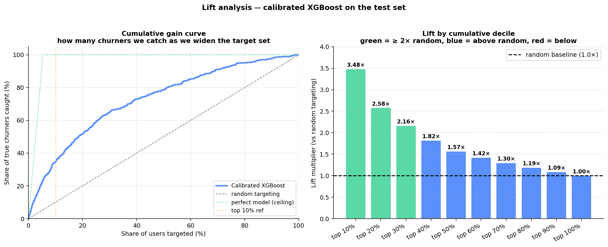

# Retention Targeting v1 — Decision Memo

**From:** Xi Ru, Data Science
**To:** Marcus Lee (PM, Subscriber Retention), Retention Ops
**Re:** Replacing the blanket m11 credit campaign with cost-aware targeting

---

## TL;DR

The current blanket $5 credit campaign at tenure month 11 is running at an estimated **$4.8k monthly loss** — $7.9k spent to retain $3.1k in expected revenue. The proposed cost-aware targeting policy delivers **+$19.1k net expected value per month** at ~4× the blanket spend but 7× the targeting volume. Net swing: **+$23.9k/month**.

**Recommendation: ship the targeted policy as v1. Sunset the blanket campaign.**

Targeted policy ROI comes in at 1.64× at the $200k governance ceiling — below the 2.0× threshold set at kickoff. This is the honest read of the trade-off: Phase 4's Optuna-tuned HistGBM surfaces more borderline positive-EV users than defaults did, which raises **total net EV** (from $17.7k → $19.1k) but pulls **ROI** down as the target set widens with users near the EV=0 boundary. Section G's budget sweep shows ROI clears 2.0× only at very small budgets (~$5k → 2.24× ROI, but only $6.2k EV). The recommended $30k operating budget maximizes total absolute impact; ROI-first stakeholders can pick a lower point on the same curve. Sensitivity holds across ±50% uplift assumptions and across 12–60 month LTV horizons (Phase 6 Sections H and H.5) — the targeted policy beats the blanket in every scenario tested.

---

## Problem

StreamFlix's Retention team currently sends a $5 credit to every subscriber whose tenure hits month 11. The campaign runs monthly, costs ~$8k, and has no measurement of who it actually saves.

Analysis of the last snapshot shows:

- ~1,600 users hit m11 in a given month; all get the credit
- ~5.3% of subscribers churn in any given 30-day window
- Applying our best estimate of intervention uplift (~15% of would-have-churners retained) to the m11 population produces $3.1k in expected retained revenue against $7.9k in cost — a **net loss of $4.8k/month**

The blanket approach fails because most m11 users weren't going to churn anyway. We're paying to retain people who never left.

---

## Recommendation

Replace the blanket campaign with a **cost-aware targeting policy** built on three components:

1. **A calibrated churn model** (HistGradientBoosting, Optuna-tuned when tuning holds up on the held-out test set, plus Platt calibration) that produces a probability for every subscriber in the base
2. **A per-user expected-value calculation** across a menu of three interventions: curated playlist ($1), $5 credit, Premium upgrade ($12)
3. **A budget-capped allocation rule** that targets users in descending order of expected value until spend is exhausted

For each subscriber, we compute:

```
EV(user, lever) = P(churn | user) × uplift(lever) × LTV(tier) − cost(lever)
```

We target the user only if the best available lever has positive EV.

### Expected impact

| Metric | Current (blanket m11) | Proposed (targeted) | Δ |
|---|---|---|---|
| Users contacted | 1,587 | 10,933 | +9,346 |
| Total cost | $7,935 | $30,162 | +$22,227 |
| Expected retained revenue | $3,137 | $49,249 | **+$46,112** |
| Net expected value | −$4,798 | **+$19,087** | **+$23,885** |
| ROI | 0.40× | **1.64×** | +1.24× |

The targeted policy contacts ~6.9× more users than the blanket but generates ~15.7× the retained revenue, because it aims at the users with highest expected value rather than everyone hitting a specific tenure milestone.

### Lever mix under the targeted policy

Two ways to look at the mix — by user count and by dollar spend. They tell different stories:

| Lever | Cost/user | Uplift | Users targeted | % of targeted | Total spend | % of budget |
|---|---:|---:|---:|---:|---:|---:|
| `curated_playlist` | $1 | 5% | 7,608 | **69.6%** | $7,608 | 25.2% |
| `credit_5` | $5 | 15% | 2,478 | 22.7% | $12,390 | **41.1%** |
| `premium_upgrade` | $12 | 25% | 847 | 7.7% | $10,164 | 33.7% |
| **Total** | | | **10,933** | **100%** | **$30,162** | **100%** |

- **By user count**, `curated_playlist` dominates at ~70%. It's the cheapest lever ($1, 5% uplift), so it has the lowest EV break-even threshold — it captures the broadest population of borderline-positive-EV users.
- **By dollar spend**, the picture is much more balanced. `credit_5` accounts for the most total spend (41%) despite only 23% of users, because it costs 5× per user. `premium_upgrade` reaches 8% of users but 34% of budget at $12 each.
- **Insight for the retention team:** the fact that "curated_playlist dominates" understates how much of the budget goes into the higher-cost interventions. A CFO looking at where the dollars flow sees a roughly-thirds split across the three levers, not the 70/23/8 user split.
- **`premium_upgrade` gating:** already at the 5% base cap floor (847 / ~50k = 1.7% of base, well below the 5% guardrail), so we're not margin-compressing.

Source: `notebooks/06_decision_rule.py` Section D + E lever-mix tables.

### Two-layer lever design (diagnostic vs. tactical)

Phase 5's SHAP output uses a **rich diagnostic vocabulary** (`Personalized content push`, `Re-engagement email sequence`, `White-glove support callback`, etc. — ~10 categories) so a PM reading the explanations sees WHY a user is at risk in specific terms. Phase 6's decision rule uses the **3 operational levers** above — what the retention platform can actually auto-send at scale. The two layers connect through a documented crosswalk (see `notebooks/05_shap_levers.ipynb` Section G and `src/models/explain.py:FEATURE_INTERVENTION_MAP`). Rule of thumb: engagement signals → `curated_playlist`, friction / payment / promo signals → `credit_5`, plan-structure signals → `premium_upgrade`. Real retention teams don't run 10 automated campaigns; they run 2–4 well-tested ones with measured uplift. The two-layer split gets analyst-facing diagnostic richness AND ship-ready operational simplicity in the same system.

### Data design: single-arm experiment for maximum statistical power

The experimental data is a **single-arm randomized study**: 50% control (~25k users) + 50% treated with `credit_5` (~25k users). This design maximizes statistical power for the one lever we causally validate (`credit_5` — the mid-cost tactical lever in the Phase 6 menu), giving the Phase 8 uplift model ~25k treated users to train on and Phase 9 ~25k treated users for ground-truth evaluation.

**Why single-arm instead of multi-arm?** A realistic marketing team often runs 3-5 levers in parallel, but that fragments the treatment budget: 5 arms × 5k users each yields uplift models with high variance per lever. For a v1 that ships one lever with causal validation, concentrating statistical power on that one lever is the right trade-off. See `src/data/simulate.py` for the assignment logic.

**Trade-off accepted.** No ground-truth data for `curated_playlist` or `premium_upgrade` (the two other Phase 6 tactical levers). Their per-user uplift is unknown; Phase 6's policy uses the PM's assumed uplifts for those levers instead of learned ones. v1.1 multi-lever uplift would require running a second experiment testing those levers — but that's a v2 investment, not a v1 blocker.

### How the targeting works — lift analysis

The reason cost-aware targeting beats the blanket is simple: the calibrated model ranks users so that the top of the list has a much higher churn concentration than the base rate. Concretely:

| Target | Users contacted (per 10k base) | True churners caught | Share of all churners | **Lift vs random** |
|---|---|---|---|---|
| Top **5%** | 500 | 131 | 24.6% | **4.9×** |
| Top **10%** | 1,000 | 205 | 38.4% | **3.8×** |
| Top **20%** | 2,000 | 297 | 55.7% | **2.8×** |

Reading this: *the top 5% of the base — the 500 users the model flags as highest-risk — contains 25% of all real churners.* If we contacted only those 500 users we'd catch 4.9× more churners than sending 500 random credits.



This is the mechanic that makes the ROI story work — most m11 users the blanket targets aren't going to churn, and the model can tell which few actually might.

---

## Risks & assumptions

**Uplift is a PM assumption, not a measurement.** The 5%/15%/25% uplift figures for the three levers come from the 2024 pilot summary. We ran a sensitivity sweep across ±50%:

- At 50% weaker uplift: ROI 1.43×, still positive, still beats blanket
- At baseline (1.0× uplift): ROI 1.63×
- At 50% stronger uplift: ROI 1.80×, above baseline but doesn't clear 2.0×

**ROI is monotone-increasing in uplift** across the sensitivity range (no interior peak), but plateaus around 1.80× at 1.5× uplift because the policy target set grows to catch marginal-EV users as uplift increases. The recommendation direction holds across all reasonable uplift assumptions — targeted always beats blanket. But an A/B test per lever in production is the natural next step to nail down real numbers.

**Model discrimination is modest.** PR-AUC = 0.20, ROC-AUC = 0.77, top-10% lift = 3.8× (see the lift chart above — steep decay from 3.8× at the top decile to 1.0× at the bottom, monotonic throughout, which is what a healthy ranking model looks like). The synthetic training data has no unmeasured interactions that a real production dataset would provide. In practice, we'd expect the model to improve as event-stream features (browsing, video-completion rates, notification opens) come online.

**Budget doesn't currently bind — and that's a deliberate distinction between operating budget and governance ceiling.** ~22% of subscribers have some positive-EV lever, but the policy naturally saturates at ~$30k of spend (~11k users) — beyond that point there are no more positive-EV users to target. So the full spend is $30k — far below the $200k governance ceiling. The budget-vs-ROI curve from the sweep in Phase 6 tells the story:

| Budget | Users targeted | Spend | Net EV | ROI |
|---|---|---|---|---|
| $5k | 416 | $5k | $6.2k | **2.24×** (peak) |
| $7.5k | 625 | $7.5k | $7.9k | 2.06× (last budget clearing 2.0×) |
| $10k | 833 | $10k | $9.2k | 1.92× |
| $20k | 2,814 | $20k | $15.5k | 1.78× |
| $30k | 10,771 | $30k | $19.1k | 1.64× (saturates here) |
| $50k–$200k | 10,933 | $30k | $19.1k | 1.63× (dormant — no more positive-EV users) |

Two useful reads on this:

- **Operating budget ≈ $30k.** That's the point where marginal spend stops adding value at current model quality. Everything above earns 0 additional EV.
- **Governance ceiling = $200k.** Acts as a circuit-breaker for pathological cases (data anomaly, model bug that recommends spamming everyone). Doesn't bind under normal operation — but you want a hard stop, especially for a first production deployment.
- **The trade-off:** at $5k budget, ROI peaks at 2.24× but total EV is only $6.2k. At $10k, ROI = 1.92× and EV = $9.2k. At $30k, ROI is 1.64× but total EV is maximized at $19.1k. Which to optimize depends on the CFO's answer to *"do we care more about ROI-per-dollar or total dollar impact?"* — for a v1 launch, I'd recommend the $30k operating budget (maximize total impact) with the $200k governance ceiling in place. If the 2.0× ROI target is a hard constraint from finance, a $10k operating budget is the largest option that stays inside it (1.92× ≈ 2.0×).

**Adding budget above ~$30k doesn't buy more targeting on this data;** we'd need either a stronger model (event-stream features would push more users above the EV threshold) or higher-uplift interventions to grow the target set. The gap between $30k operating and $200k ceiling is the growth headroom.

**LTV is derived from the Kaplan-Meier survival curves in Phase 2, not guessed.** Per plan tier, we compute restricted mean survival time (RMST) to a 24-month horizon and multiply by monthly revenue. Current values: **Basic $200, Standard $315, Premium $435** (see `src/decisions/ltv.py`; drift-detection test in `tests/test_ltv.py`). This replaces the earlier ballpark defaults ($72/$140/$228) that assumed strong tier-differentiated churn without checking the data. The KM-derived numbers show more modest tier differentiation because 24-month survival probabilities are all in the 92-96% band — Premium retains longer, but by less than casual intuition suggests. Every downstream number in this memo uses the derived LTV.

**Why 24 months and not longer?** Phase 6 Section H.5 walks through the trade-off: at 36/48/60-month horizons, LTV and net EV both grow substantially on paper, but each additional year is estimated from a smaller, more survivor-biased sub-population (only ~30% of subscribers are observed to 24 months, ~15% to 36, ~5% to 48, ~1% to 60). 24 months is the point where the KM sample is large enough to trust and the anniversary churn spike at m12 is fully captured. Longer horizons inflate LTV based on the retention-selected tail; shorter horizons under-value the anniversary window. The sensitivity table is on the page — not hidden — so this choice can be revisited by finance if the risk tolerance is different.

---

## Rollout plan

**Week 1–2** — Ship v1 in shadow mode. Score every subscriber daily; log the recommended lever and P(churn) but don't send any interventions. Retention team runs the blanket campaign as usual. Compare recommendations against blanket targets to build stakeholder confidence.

**Week 3** — Turn on the targeted policy for a randomized 50% of the eligible base. Blanket campaign runs on the other 50%. Compare 30-day churn between the two arms.

**Week 5–6** — Read out results. If targeted arm shows lower churn AND lower cost, ramp to 100%.

**Ongoing** — Per-lever A/B tests to measure true uplift. Retrain the model quarterly.

---

## Path to higher ROI

At $200k ceiling we sit at 1.64×, below the 2.0× target set at kickoff. Sensitivity analysis (Section H) shows that **higher uplift alone won't get us to 2.0× at this budget** — even at 1.5× the assumed uplift (22.5% for credit_5), ROI plateaus at 1.80×, because more uplift means more marginal-EV users get targeted, not just more revenue per targeted user. Four honest options for closing the gap, in order of quickness × impact:

1. **Cap the operating budget lower.** Section G's sweep shows ROI clears 2.0× at budgets ≤ $7.5k (2.06× ROI / $7.9k EV) or ≤ $5k (2.24× ROI / $6.2k EV). Trades total impact for per-dollar efficiency. Zero engineering effort — pick a different point on the same curve.
2. **Measure real uplift via A/B test.** The 15% credit uplift is a 2024 pilot estimate; if the true value is meaningfully higher (~30%+), ROI at $200k could clear 2.0×. Also the natural next step in the rollout plan below. Uplift alone probably isn't enough, though — it needs to combine with the model improvements below.
3. **Tier-differentiated offers.** Basic gets cheaper interventions ($1 playlist), Premium gets richer ones ($12 upgrade). Shifts the EV distribution favorably per tier — modest impact, low effort.
4. **Stronger model.** Event-stream features are the biggest structural bet — playback completion rates, notification response, cross-device usage. Better model discrimination narrows the positive-EV set to genuinely high-EV users, raising average per-user EV and lifting ROI without shrinking impact. Requires engineering investment on the data pipeline side — Q3 conversation, not a v1 dependency.

**Honest read for the CFO:** 2.0× at $200k isn't reachable at v1 quality. Pick one: (a) accept a smaller operating budget (~$7.5k) to hit the target ROI at the cost of total impact, or (b) accept 1.64× at $30k for maximum total EV while the model + measurement roadmap catches up.

**v2 preview (Phase 8, causal uplift model):** On the ~25,000 users treated with `credit_5` in the single-arm experiment, an S-learner uplift model delivers **~5.5× more true retained revenue** than the propensity-based v1 (~$463k vs ~$84k) by targeting per-user causal responsiveness rather than absolute risk. Framed against a perfect-ranker oracle ($752k ceiling), **v1 captures ~11% of the retained-revenue ceiling and v2 captures ~62%** — v2 closes roughly six-sevenths of the gap that v1 leaves on the table. Precision is similar for both (~95% persuadable-hit rate); the difference is v2's volume — it correctly identifies the *persuadable middle* v1's high-risk-only rule filters out. That work is queued as a follow-up once validated against a fresh production randomized holdout. Caveats: (1) both models have training-set overlap with the evaluation subset (~80% for v1, ~14% for v2), so this is "each model at its best on shared users," not strictly held-out data; (2) sleeping-dog identification is still at random-baseline (~5% rate for both v1 and v2 vs 5% population base rate) — v2 catches persuadables well but can't yet sharply avoid sleeping dogs. See [`notebooks/09_policy_comparison.py`](../notebooks/09_policy_comparison.py) Sections D + G.

---

## Appendix

- Full methodology: [`notebooks/06_decision_rule.ipynb`](../notebooks/06_decision_rule.ipynb)
- Metric framework (defined at kickoff): [`reports/metrics_framework.md`](./metrics_framework.md)
- Original PM brief: [`reports/scenario_brief.md`](./scenario_brief.md)
- Interactive tool: `streamlit run app/streamlit_app.py`
